# 18. ERD (Entity-Relationship Diagram)

> **주의 (범위와 신뢰도)**: 이 문서는 저장소 루트의 `schema.sql` + `add_*.sql`/`fix_*.sql` 마이그레이션 파일들을 정적으로 파싱해 만든 ERD입니다.
> 실제 운영 Supabase 프로젝트에 `pg_catalog`를 직접 조회(introspection)한 결과가 **아닙니다**.
> `docs/DATABASE.md`가 이미 강조하는 것처럼, **저장소 파일 존재와 운영 Supabase 적용 상태는 구분**됩니다 — 이 문서에 나온 테이블/컬럼/FK는 "저장소에 정의된 스키마" 기준이며,
> 운영 DB에 아직 적용되지 않은 `add_*.sql`/`fix_*.sql`이 있다면 실제 운영 스키마와 차이가 있을 수 있습니다. 적용 여부는 Supabase SQL Editor에서 직접 확인하세요.

## 개요

- 분석 대상: `schema.sql`(기본 스키마) + 루트의 `add_*.sql`/`fix_*.sql`(증분 마이그레이션) 총 73개 SQL 파일
- 추출된 테이블 수: **65개**
- 추출된 FK(외래키) 관계 수: **131개**
- 컬럼 목록에는 `create table` 원본 정의뿐 아니라 이후 `alter table ... add column`으로 추가된 컬럼도 모두 포함되어 있습니다(마지막 `origin` 열이 그 컬럼을 도입한 SQL 파일입니다).
- RLS 정책, 권한(permission) 상세, 각 테이블의 코드 사용 현황(레거시 여부 등)은 이 문서의 범위가 아닙니다 → [docs/DATABASE.md](DATABASE.md) 참고.

## 1. 테이블 목록 (도메인별, 65개)

아래 도메인 구분은 이 문서 작성 시 가독성을 위해 임의로 묶은 것이며, 실제 스키마에 정의된 그룹핑은 아닙니다. 괄호는 해당 테이블이 `create table`로 정의된 파일입니다.

**계정/프로필**

- `accounts` (schema.sql)
- `profiles` (schema.sql)

**센터/조직/권한**

- `centers` (schema.sql)
- `center_roles` (schema.sql)
- `center_settings` (schema.sql)
- `center_contacts` (schema.sql)
- `center_holidays` (schema.sql)
- `center_member_fields` (schema.sql)
- `manager_centers` (schema.sql)
- `account_center_permissions` (schema.sql)
- `permissions` (schema.sql)
- `role_permissions` (schema.sql)
- `rooms` (schema.sql)
- `class_types` (schema.sql)

**회원/회원권**

- `center_members` (schema.sql)
- `member_grades` (schema.sql)
- `member_center_colors` (schema.sql)
- `profile_center_fields` (schema.sql)
- `memberships` (schema.sql)
- `membership_transfers` (schema.sql)
- `membership_schedule_rules` (schema.sql)
- `product_passes` (schema.sql)

**상품/결제/계약**

- `products` (schema.sql)
- `class_allowed_products` (schema.sql)
- `payments` (schema.sql)
- `orders` (schema.sql)
- `purchase_requests` (schema.sql)
- `cart_items` (add_product_extras.sql)
- `contracts` (schema.sql)
- `contract_templates` (schema.sql)

**예약/수업/스태프**

- `classes` (schema.sql)
- `class_trainers` (schema.sql)
- `reservations` (schema.sql)
- `schedule_templates` (schema.sql)
- `schedule_memos` (schema.sql)
- `staff_schedules` (schema.sql)
- `staff_salaries` (schema.sql)

**관리자 활동/감사로그**

- `admin_action_logs` (add_admin_assignment.sql)
- `change_logs` (schema.sql)

**알림/커뮤니케이션**

- `notifications` (add_notifications.sql)
- `notification_rules` (schema.sql)
- `notification_logs` (schema.sql)
- `messages` (schema.sql)
- `chat_messages` (schema.sql)
- `inquiry_threads` (add_inquiries.sql)
- `inquiry_messages` (add_inquiries.sql)
- `center_announcements` (add_announcements.sql)
- `popup_notices` (schema.sql)
- `terms` (schema.sql)

**커뮤니티/리뷰/포인트**

- `community_posts` (schema.sql)
- `community_comments` (schema.sql)
- `reviews` (schema.sql)
- `center_reviews` (fix_center_reviews.sql)
- `point_accounts` (add_reviews_points.sql)
- `point_logs` (add_reviews_points.sql)
- `point_transactions` (schema.sql)

**코칭/진행기록**

- `progress_categories` (schema.sql)
- `progress_records` (schema.sql)

**락커**

- `lockers` (schema.sql)
- `locker_assignments` (schema.sql)

**마케팅/기타**

- `leads` (schema.sql)
- `expenses` (schema.sql)
- `home_banners` (schema.sql)
- `competitions` (schema.sql)
- `service_categories` (schema.sql)

## 2. Mermaid ER Diagram

각 엔티티에는 가독성을 위해 **기본키(PK)와 외래키(FK) 컬럼만** 표시합니다. 전체 컬럼 목록은 [3. 테이블별 컬럼 상세](#3-테이블별-컬럼-상세)를 참고하세요.

```mermaid
erDiagram
    account_center_permissions {
        uuid id PK
        text permission_key FK "-> permissions"
        uuid manager_center_id FK "-> manager_centers"
    }
    accounts {
        uuid id PK
    }
    admin_action_logs {
        uuid id PK
        uuid center_id FK "-> centers"
        uuid reservation_id FK "-> reservations"
        uuid admin_id FK "-> accounts"
        uuid member_profile_id FK "-> profiles"
        uuid class_id FK "-> classes"
        uuid membership_id FK "-> memberships"
        uuid source_unassigned_id FK "-> memberships"
    }
    cart_items {
        uuid id PK
        uuid profile_id FK "-> profiles"
        uuid center_id FK "-> centers"
        uuid product_id FK "-> products"
    }
    center_announcements {
        uuid id PK
        uuid center_id FK "-> centers"
        uuid created_by FK "-> accounts"
    }
    center_contacts {
        uuid id PK
        uuid center_id FK "-> centers"
    }
    center_holidays {
        uuid id PK
        uuid center_id FK "-> centers"
    }
    center_member_fields {
        uuid id PK
        uuid center_id FK "-> centers"
    }
    center_members {
        uuid id PK
        uuid center_id FK "-> centers"
        uuid profile_id FK "-> profiles"
        uuid grade_id FK "-> member_grades"
    }
    center_reviews {
        uuid id PK
        uuid center_id FK "-> centers"
        uuid profile_id FK "-> profiles"
    }
    center_roles {
        uuid id PK
        uuid center_id FK "-> centers"
    }
    center_settings {
        uuid center_id PK
    }
    centers {
        uuid id PK
    }
    change_logs {
        uuid id PK
        uuid center_id FK "-> centers"
        uuid actor_account_id FK "-> accounts"
    }
    chat_messages {
        uuid id PK
        uuid sender_account_id FK "-> accounts"
        uuid receiver_account_id FK "-> accounts"
    }
    class_allowed_products {
        uuid id PK
        uuid class_id FK "-> classes"
        uuid product_id FK "-> products"
    }
    class_trainers {
        uuid id PK
        uuid class_id FK "-> classes"
        uuid account_id FK "-> accounts"
    }
    class_types {
        uuid id PK
        uuid center_id FK "-> centers"
    }
    classes {
        uuid id PK
        uuid center_id FK "-> centers"
        uuid class_type_id FK "-> class_types"
        uuid room_id FK "-> rooms"
    }
    community_comments {
        uuid id PK
        uuid post_id FK "-> community_posts"
        uuid author_account_id FK "-> accounts"
    }
    community_posts {
        uuid id PK
        uuid author_account_id FK "-> accounts"
        uuid center_id FK "-> centers"
    }
    competitions {
        uuid id PK
    }
    contract_templates {
        uuid id PK
        uuid center_id FK "-> centers"
    }
    contracts {
        uuid id PK
        uuid center_id FK "-> centers"
        uuid profile_id FK "-> profiles"
        uuid template_id FK "-> contract_templates"
        uuid membership_id FK "-> memberships"
    }
    expenses {
        uuid id PK
        uuid center_id FK "-> centers"
    }
    home_banners {
        uuid id PK
    }
    inquiry_messages {
        uuid id PK
        uuid thread_id FK "-> inquiry_threads"
        uuid sender_account_id FK "-> accounts"
    }
    inquiry_threads {
        uuid id PK
        uuid center_id FK "-> centers"
        uuid member_account_id FK "-> accounts"
    }
    leads {
        uuid id PK
        uuid center_id FK "-> centers"
    }
    locker_assignments {
        uuid id PK
        uuid locker_id FK "-> lockers"
        uuid profile_id FK "-> profiles"
    }
    lockers {
        uuid id PK
        uuid center_id FK "-> centers"
    }
    manager_centers {
        uuid id PK
        uuid account_id FK "-> accounts"
        uuid center_id FK "-> centers"
        uuid role_id FK "-> center_roles"
    }
    member_center_colors {
        uuid id PK
        uuid account_id FK "-> accounts"
        uuid center_id FK "-> centers"
    }
    member_grades {
        uuid id PK
        uuid center_id FK "-> centers"
    }
    membership_schedule_rules {
        uuid id PK
        uuid product_id FK "-> products"
    }
    membership_transfers {
        uuid id PK
        uuid membership_id FK "-> memberships"
        uuid from_profile_id FK "-> profiles"
        uuid to_profile_id FK "-> profiles"
    }
    memberships {
        uuid id PK
        uuid profile_id FK "-> profiles"
        uuid center_id FK "-> centers"
        uuid trainer_account_id FK "-> accounts"
        uuid product_id FK "-> products"
        uuid bound_profile_id FK "-> profiles"
    }
    messages {
        uuid id PK
        uuid center_id FK "-> centers"
        uuid sender_account_id FK "-> accounts"
    }
    notification_logs {
        uuid id PK
        uuid center_id FK "-> centers"
        uuid profile_id FK "-> profiles"
        uuid rule_id FK "-> notification_rules"
    }
    notification_rules {
        uuid id PK
        uuid center_id FK "-> centers"
    }
    notifications {
        uuid id PK
        uuid recipient_account_id FK "-> accounts"
        uuid center_id FK "-> centers"
    }
    orders {
        uuid id PK
        uuid center_id FK "-> centers"
        uuid profile_id FK "-> profiles"
        uuid product_id FK "-> products"
    }
    payments {
        uuid id PK
        uuid profile_id FK "-> profiles"
        uuid center_id FK "-> centers"
        uuid membership_id FK "-> memberships"
        uuid trainer_account_id FK "-> accounts"
        uuid product_pass_id FK "-> product_passes"
    }
    permissions {
        text key PK
        text parent_key FK "-> permissions"
    }
    point_accounts {
        uuid id PK
        uuid center_id FK "-> centers"
        uuid profile_id FK "-> profiles"
    }
    point_logs {
        uuid id PK
        uuid center_id FK "-> centers"
        uuid profile_id FK "-> profiles"
    }
    point_transactions {
        uuid id PK
        uuid profile_id FK "-> profiles"
        uuid center_id FK "-> centers"
        uuid payment_id FK "-> payments"
    }
    popup_notices {
        uuid id PK
        uuid center_id FK "-> centers"
    }
    product_passes {
        uuid id PK
        uuid profile_id FK "-> profiles"
        uuid product_id FK "-> products"
        uuid linked_membership_id FK "-> memberships"
    }
    products {
        uuid id PK
        uuid center_id FK "-> centers"
    }
    profile_center_fields {
        uuid id PK
        uuid profile_id FK "-> profiles"
        uuid center_id FK "-> centers"
    }
    profiles {
        uuid id PK
        uuid account_id FK "-> accounts"
    }
    progress_categories {
        uuid id PK
        uuid center_id FK "-> centers"
        uuid parent_id FK "-> progress_categories"
    }
    progress_records {
        uuid id PK
        uuid profile_id FK "-> profiles"
        uuid category_id FK "-> progress_categories"
        uuid coach_account_id FK "-> accounts"
    }
    purchase_requests {
        uuid id PK
        uuid center_id FK "-> centers"
        uuid profile_id FK "-> profiles"
        uuid product_id FK "-> products"
    }
    reservations {
        uuid id PK
        uuid class_id FK "-> classes"
        uuid profile_id FK "-> profiles"
        uuid membership_id FK "-> memberships"
        uuid created_by_account_id FK "-> accounts"
        uuid cancelled_by FK "-> accounts"
    }
    reviews {
        uuid id PK
        uuid reviewer_account_id FK "-> accounts"
        uuid target_account_id FK "-> accounts"
        uuid target_center_id FK "-> centers"
        uuid center_id FK "-> centers"
        uuid profile_id FK "-> profiles"
    }
    role_permissions {
        uuid id PK
        uuid role_id FK "-> center_roles"
        text permission_key FK "-> permissions"
    }
    rooms {
        uuid id PK
        uuid center_id FK "-> centers"
    }
    schedule_memos {
        uuid id PK
        uuid class_id FK "-> classes"
        uuid staff_schedule_id FK "-> staff_schedules"
        uuid author_account_id FK "-> accounts"
    }
    schedule_templates {
        uuid id PK
        uuid center_id FK "-> centers"
    }
    service_categories {
        uuid id PK
    }
    staff_salaries {
        uuid id PK
        uuid center_id FK "-> centers"
        uuid account_id FK "-> accounts"
    }
    staff_schedules {
        uuid id PK
        uuid center_id FK "-> centers"
        uuid account_id FK "-> accounts"
    }
    terms {
        uuid id PK
        uuid center_id FK "-> centers"
    }

    accounts ||--o{ profiles : "account_id"
    centers ||--o{ center_roles : "center_id"
    center_roles ||--o{ role_permissions : "role_id"
    permissions ||--o{ role_permissions : "permission_key"
    permissions ||--o{ permissions : "parent_key"
    accounts ||--o{ manager_centers : "account_id"
    centers ||--o{ manager_centers : "center_id"
    center_roles ||--o{ manager_centers : "role_id"
    centers ||--o{ rooms : "center_id"
    centers ||--o{ class_types : "center_id"
    centers ||--o{ center_settings : "center_id"
    centers ||--o{ lockers : "center_id"
    lockers ||--o{ locker_assignments : "locker_id"
    profiles ||--o{ locker_assignments : "profile_id"
    centers ||--o{ classes : "center_id"
    class_types ||--o{ classes : "class_type_id"
    rooms ||--o{ classes : "room_id"
    classes ||--o{ class_trainers : "class_id"
    accounts ||--o{ class_trainers : "account_id"
    profiles ||--o{ memberships : "profile_id"
    centers ||--o{ memberships : "center_id"
    accounts ||--o{ memberships : "trainer_account_id"
    products ||--o{ memberships : "product_id"
    profiles ||--o{ memberships : "bound_profile_id"
    classes ||--o{ class_allowed_products : "class_id"
    products ||--o{ class_allowed_products : "product_id"
    classes ||--o{ reservations : "class_id"
    profiles ||--o{ reservations : "profile_id"
    memberships ||--o{ reservations : "membership_id"
    accounts ||--o{ reservations : "created_by_account_id"
    accounts ||--o{ reservations : "cancelled_by"
    profiles ||--o{ payments : "profile_id"
    centers ||--o{ payments : "center_id"
    memberships ||--o{ payments : "membership_id"
    accounts ||--o{ payments : "trainer_account_id"
    product_passes ||--o{ payments : "product_pass_id"
    centers ||--o{ expenses : "center_id"
    profiles ||--o{ point_transactions : "profile_id"
    centers ||--o{ point_transactions : "center_id"
    payments ||--o{ point_transactions : "payment_id"
    accounts ||--o{ chat_messages : "sender_account_id"
    accounts ||--o{ chat_messages : "receiver_account_id"
    memberships ||--o{ membership_transfers : "membership_id"
    profiles ||--o{ membership_transfers : "from_profile_id"
    profiles ||--o{ membership_transfers : "to_profile_id"
    centers ||--o{ popup_notices : "center_id"
    accounts ||--o{ community_posts : "author_account_id"
    centers ||--o{ community_posts : "center_id"
    community_posts ||--o{ community_comments : "post_id"
    accounts ||--o{ community_comments : "author_account_id"
    accounts ||--o{ reviews : "reviewer_account_id"
    accounts ||--o{ reviews : "target_account_id"
    centers ||--o{ reviews : "target_center_id"
    centers ||--o{ reviews : "center_id"
    profiles ||--o{ reviews : "profile_id"
    centers ||--o{ progress_categories : "center_id"
    progress_categories ||--o{ progress_categories : "parent_id"
    profiles ||--o{ progress_records : "profile_id"
    progress_categories ||--o{ progress_records : "category_id"
    accounts ||--o{ progress_records : "coach_account_id"
    accounts ||--o{ member_center_colors : "account_id"
    centers ||--o{ member_center_colors : "center_id"
    centers ||--o{ center_holidays : "center_id"
    centers ||--o{ member_grades : "center_id"
    centers ||--o{ center_members : "center_id"
    profiles ||--o{ center_members : "profile_id"
    member_grades ||--o{ center_members : "grade_id"
    centers ||--o{ leads : "center_id"
    centers ||--o{ change_logs : "center_id"
    accounts ||--o{ change_logs : "actor_account_id"
    centers ||--o{ staff_salaries : "center_id"
    accounts ||--o{ staff_salaries : "account_id"
    centers ||--o{ staff_schedules : "center_id"
    accounts ||--o{ staff_schedules : "account_id"
    classes ||--o{ schedule_memos : "class_id"
    staff_schedules ||--o{ schedule_memos : "staff_schedule_id"
    accounts ||--o{ schedule_memos : "author_account_id"
    centers ||--o{ contract_templates : "center_id"
    centers ||--o{ terms : "center_id"
    centers ||--o{ contracts : "center_id"
    profiles ||--o{ contracts : "profile_id"
    contract_templates ||--o{ contracts : "template_id"
    memberships ||--o{ contracts : "membership_id"
    centers ||--o{ center_member_fields : "center_id"
    profiles ||--o{ profile_center_fields : "profile_id"
    centers ||--o{ profile_center_fields : "center_id"
    centers ||--o{ products : "center_id"
    profiles ||--o{ product_passes : "profile_id"
    products ||--o{ product_passes : "product_id"
    memberships ||--o{ product_passes : "linked_membership_id"
    centers ||--o{ schedule_templates : "center_id"
    centers ||--o{ notification_rules : "center_id"
    centers ||--o{ messages : "center_id"
    accounts ||--o{ messages : "sender_account_id"
    centers ||--o{ notification_logs : "center_id"
    profiles ||--o{ notification_logs : "profile_id"
    notification_rules ||--o{ notification_logs : "rule_id"
    centers ||--o{ center_contacts : "center_id"
    centers ||--o{ purchase_requests : "center_id"
    profiles ||--o{ purchase_requests : "profile_id"
    products ||--o{ purchase_requests : "product_id"
    centers ||--o{ orders : "center_id"
    profiles ||--o{ orders : "profile_id"
    products ||--o{ orders : "product_id"
    permissions ||--o{ account_center_permissions : "permission_key"
    manager_centers ||--o{ account_center_permissions : "manager_center_id"
    products ||--o{ membership_schedule_rules : "product_id"
    centers ||--o{ admin_action_logs : "center_id"
    reservations ||--o{ admin_action_logs : "reservation_id"
    accounts ||--o{ admin_action_logs : "admin_id"
    profiles ||--o{ admin_action_logs : "member_profile_id"
    classes ||--o{ admin_action_logs : "class_id"
    memberships ||--o{ admin_action_logs : "membership_id"
    memberships ||--o{ admin_action_logs : "source_unassigned_id"
    centers ||--o{ center_announcements : "center_id"
    accounts ||--o{ center_announcements : "created_by"
    centers ||--o{ inquiry_threads : "center_id"
    accounts ||--o{ inquiry_threads : "member_account_id"
    inquiry_threads ||--o{ inquiry_messages : "thread_id"
    accounts ||--o{ inquiry_messages : "sender_account_id"
    accounts ||--o{ notifications : "recipient_account_id"
    centers ||--o{ notifications : "center_id"
    profiles ||--o{ cart_items : "profile_id"
    centers ||--o{ cart_items : "center_id"
    products ||--o{ cart_items : "product_id"
    centers ||--o{ center_reviews : "center_id"
    profiles ||--o{ center_reviews : "profile_id"
    centers ||--o{ point_accounts : "center_id"
    profiles ||--o{ point_accounts : "profile_id"
    centers ||--o{ point_logs : "center_id"
    profiles ||--o{ point_logs : "profile_id"
```

## 3. 테이블별 컬럼 상세

`origin`은 해당 컬럼을 최초로 정의한 SQL 파일입니다. `schema.sql`이 아닌 파일이면 이후 마이그레이션으로 추가된 컬럼임을 의미합니다.

### `account_center_permissions`

| 컬럼 | 타입/제약 (요약) | 도입 파일 |
|---|---|---|
| `id` | uuid primary key default gen_random_uuid() | schema.sql |
| `manager_center_id` | uuid not null,                             -- manager_centers(id). FK는 아래에서 추가(정… | schema.sql |
| `permission_key` | text not null,                             -- permissions.key 참조 (FK 아래에서 추가) | schema.sql |
| `grant_type` | text not null check (grant_type in ('allow', 'deny')) | schema.sql |
| `created_at` | timestamptz not null default now() | schema.sql |

### `accounts`

| 컬럼 | 타입/제약 (요약) | 도입 파일 |
|---|---|---|
| `id` | uuid primary key default gen_random_uuid() | schema.sql |
| `auth_id` | uuid unique not null,                         -- Supabase Auth 계정과 연결 | schema.sql |
| `name` | text not null,                                -- 가입자 본인 이름 | schema.sql |
| `phone` | text unique,                                  -- 휴대폰번호 | schema.sql |
| `address` | text,                                         -- 주소 (선택, 회원 검색용) | schema.sql |
| `is_member` | boolean not null default true,                -- 회원 역할 사용 여부 | schema.sql |
| `is_manager` | boolean not null default false,               -- 매니저 역할 사용 여부 | schema.sql |
| `is_platform_admin` | boolean not null default false | schema.sql |
| `created_at` | timestamptz not null default now() | schema.sql |

### `admin_action_logs`

| 컬럼 | 타입/제약 (요약) | 도입 파일 |
|---|---|---|
| `id` | uuid primary key default gen_random_uuid() | add_admin_assignment.sql |
| `center_id` | uuid not null references centers(id) | add_admin_assignment.sql |
| `reservation_id` | uuid not null references reservations(id) | add_admin_assignment.sql |
| `action_type` | text not null check (action_type in | add_admin_assignment.sql |
| `reservation_type` | text not null | add_admin_assignment.sql |
| `reservation_source` | text not null | add_admin_assignment.sql |
| `admin_id` | uuid not null references accounts(id) | add_admin_assignment.sql |
| `member_profile_id` | uuid not null references profiles(id) | add_admin_assignment.sql |
| `class_id` | uuid not null references classes(id) | add_admin_assignment.sql |
| `membership_id` | uuid references memberships(id) | add_admin_assignment.sql |
| `source_unassigned_id` | uuid references memberships(id),  -- 배치에 사용된 미배치건/수강권 스냅샷(감사용, membership_id와 동일… | add_admin_assignment.sql |
| `reason_code` | text | add_admin_assignment.sql |
| `reason_detail` | text | add_admin_assignment.sql |
| `capacity_override` | boolean not null default false | add_admin_assignment.sql |
| `membership_consumed` | boolean not null default false | add_admin_assignment.sql |
| `member_name_snapshot` | text | add_admin_assignment.sql |
| `class_title_snapshot` | text | add_admin_assignment.sql |
| `class_start_snapshot` | timestamptz | add_admin_assignment.sql |
| `before_state` | jsonb | add_admin_assignment.sql |
| `after_state` | jsonb | add_admin_assignment.sql |
| `created_at` | timestamptz not null default now() | add_admin_assignment.sql |

### `cart_items`

| 컬럼 | 타입/제약 (요약) | 도입 파일 |
|---|---|---|
| `id` | uuid primary key default gen_random_uuid() | add_product_extras.sql |
| `profile_id` | uuid not null references profiles(id) on delete cascade | add_product_extras.sql |
| `center_id` | uuid not null references centers(id) on delete cascade | add_product_extras.sql |
| `product_id` | uuid not null references products(id) on delete cascade | add_product_extras.sql |
| `product_name` | text not null | add_product_extras.sql |
| `price` | int not null default 0 | add_product_extras.sql |
| `selected_size` | text | add_product_extras.sql |
| `created_at` | timestamptz not null default now() | add_product_extras.sql |

### `center_announcements`

| 컬럼 | 타입/제약 (요약) | 도입 파일 |
|---|---|---|
| `id` | uuid primary key default gen_random_uuid() | add_announcements.sql |
| `center_id` | uuid not null references centers(id) on delete cascade | add_announcements.sql |
| `title` | text not null | add_announcements.sql |
| `body` | text not null default '',          -- 서식 포함 HTML | add_announcements.sql |
| `photos` | text[],                             -- 스토리지 경로 배열 (avatars 버킷 재사용) | add_announcements.sql |
| `pinned` | boolean not null default false,     -- 상단 고정 | add_announcements.sql |
| `created_by` | uuid references accounts(id),       -- 작성한 매니저 계정 | add_announcements.sql |
| `created_at` | timestamptz not null default now() | add_announcements.sql |
| `updated_at` | timestamptz | add_announcements.sql |

### `center_contacts`

| 컬럼 | 타입/제약 (요약) | 도입 파일 |
|---|---|---|
| `id` | uuid primary key default gen_random_uuid() | schema.sql |
| `center_id` | uuid not null references centers(id) | schema.sql |
| `channel_type` | text not null | schema.sql |
| `value` | text not null,                                -- 채널 URL 또는 번호 | schema.sql |
| `label` | text,                                         -- 표시 이름 | schema.sql |
| `sort_order` | int not null default 0 | schema.sql |

### `center_holidays`

| 컬럼 | 타입/제약 (요약) | 도입 파일 |
|---|---|---|
| `id` | uuid primary key default gen_random_uuid() | schema.sql |
| `center_id` | uuid not null references centers(id) | schema.sql |
| `holiday_date` | date not null,                                     -- 휴무 날짜 | schema.sql |
| `reason` | text,                                                -- 사유 (예: "정기휴무", "빙질정비") | schema.sql |

### `center_member_fields`

| 컬럼 | 타입/제약 (요약) | 도입 파일 |
|---|---|---|
| `id` | uuid primary key default gen_random_uuid() | schema.sql |
| `center_id` | uuid not null references centers(id) | schema.sql |
| `field_key` | text not null,                            -- 'birth_date','address','blood_type'… | schema.sql |
| `label` | text not null,                            -- 화면에 보일 이름 (예: "신발 사이즈") | schema.sql |
| `field_type` | text not null default 'text' | schema.sql |
| `options` | text[],                                   -- select인 경우 선택지 | schema.sql |
| `is_required` | boolean not null default false,           -- 이 센터 등록 시 필수 입력인지 | schema.sql |
| `show_in_member_list` | boolean not null default false,         -- 관리자 회원목록에 노출할지 (회원용에는 안 보임) | schema.sql |
| `sort_order` | int not null default 0 | schema.sql |

### `center_members`

| 컬럼 | 타입/제약 (요약) | 도입 파일 |
|---|---|---|
| `id` | uuid primary key default gen_random_uuid() | schema.sql |
| `center_id` | uuid not null references centers(id) | schema.sql |
| `profile_id` | uuid not null references profiles(id) | schema.sql |
| `grade_id` | uuid references member_grades(id),           -- 회원 등급 | schema.sql |
| `registered_at` | date not null default current_date,          -- 등록일 | schema.sql |
| `last_attended_at` | date,                                       -- 최근 출석일 | schema.sql |
| `app_linked` | boolean not null default false,              -- 앱연결 여부 | schema.sql |
| `app_email` | text,                                        -- 앱연결 이메일 | schema.sql |
| `memo` | text,                                        -- 관리자 메모 (회원에겐 안 보임) | schema.sql |
| `status` | text not null default 'active' | schema.sql |
| `dormant_since` | timestamptz | add_member_dormant.sql |

### `center_reviews`

| 컬럼 | 타입/제약 (요약) | 도입 파일 |
|---|---|---|
| `id` | uuid primary key default gen_random_uuid() | fix_center_reviews.sql |
| `center_id` | uuid not null references centers(id) on delete cascade | fix_center_reviews.sql |
| `profile_id` | uuid not null references profiles(id) on delete cascade | fix_center_reviews.sql |
| `rating` | int  not null check (rating between 1 and 5) | fix_center_reviews.sql |
| `content` | text not null | fix_center_reviews.sql |
| `photos` | text[],                                  -- 후기 사진 (storage 경로, 여러 장) | fix_center_reviews.sql |
| `created_at` | timestamptz not null default now() | fix_center_reviews.sql |
| `reply` | text | add_review_reply.sql |
| `replied_at` | timestamptz | add_review_reply.sql |
| `hidden` | boolean not null default false | add_review_reply.sql |

### `center_roles`

| 컬럼 | 타입/제약 (요약) | 도입 파일 |
|---|---|---|
| `id` | uuid primary key default gen_random_uuid() | schema.sql |
| `center_id` | uuid not null references centers(id) | schema.sql |
| `name` | text not null,                                -- '스튜디오 오너' / '매니저' / '강사' / 커스텀 | schema.sql |
| `role_key` | text,                                         -- 'owner'/'manager'/'trainer' (기본… | schema.sql |
| `is_system` | boolean not null default false,               -- 기본 역할이면 true (삭제 불가) | schema.sql |
| `is_owner` | boolean not null default false,               -- 오너 역할이면 true (모든 권한 자동 보유) | schema.sql |
| `sort_order` | int not null default 0 | schema.sql |
| `created_at` | timestamptz not null default now() | schema.sql |

### `center_settings`

| 컬럼 | 타입/제약 (요약) | 도입 파일 |
|---|---|---|
| `center_id` | uuid primary key references centers(id) | schema.sql |
| `private_book_days_before` | int not null default 1 | schema.sql |
| `private_book_time` | time not null default '22:00' | schema.sql |
| `group_book_days_before` | int not null default 1 | schema.sql |
| `group_book_time` | time not null default '22:00' | schema.sql |
| `private_cancel_days_before` | int not null default 1 | schema.sql |
| `private_cancel_time` | time not null default '22:00' | schema.sql |
| `group_cancel_days_before` | int not null default 1 | schema.sql |
| `group_cancel_time` | time not null default '22:00' | schema.sql |
| `allow_same_day_booking` | boolean not null default true,          -- 당일 예약 허용 여부 | schema.sql |
| `same_day_change_hours` | int not null default 24 | schema.sql |
| `same_day_change_minutes` | int not null default 0 | schema.sql |
| `autocancel_hours` | int not null default 0 | schema.sql |
| `autocancel_minutes` | int not null default 0 | schema.sql |
| `waitlist_auto_hours` | int not null default 0 | schema.sql |
| `waitlist_auto_minutes` | int not null default 0 | schema.sql |
| `waitlist_weekly_limit` | int not null default 0 | schema.sql |
| `daily_book_limit_enabled` | boolean not null default false | schema.sql |
| `daily_book_limit` | int | schema.sql |
| `private_open_days_before` | int not null default 60 | schema.sql |
| `private_open_time` | time not null default '15:00' | schema.sql |
| `group_open_days_before` | int not null default 60 | schema.sql |
| `group_open_time` | time not null default '15:00' | schema.sql |
| `private_slot_unit` | text not null default '30min' | schema.sql |
| `private_max_concurrent_enabled` | boolean not null default false | schema.sql |
| `private_max_concurrent` | int | schema.sql |
| `show_group_reserved_count` | boolean not null default true | schema.sql |
| `show_group_waitlist_count` | boolean not null default true | schema.sql |
| `use_inquiry_board` | boolean not null default true,   -- 11. 문의 게시판 | schema.sql |
| `show_all_classes` | boolean not null default true,   -- 12. 수강권으로 볼 수 없는 수업도 표시 | schema.sql |
| `use_locker` | boolean not null default false,  -- 13. 락커 기능 | schema.sql |
| `deduct_on_late_cancel` | boolean not null default false, -- 14. 취소 가능 시간 후 취소 시 횟수 차감 | schema.sql |
| `auto_unpaid_input` | boolean not null default false,  -- 15. 수강권 미수금 자동 입력 | schema.sql |
| `use_lounge` | boolean not null default true,   -- 16. 회원앱 라운지 | schema.sql |
| `show_point_history` | boolean not null default true,   -- 17. 회원앱 포인트 내역 조회 | schema.sql |
| `updated_at` | timestamptz not null default now() | schema.sql |

### `centers`

| 컬럼 | 타입/제약 (요약) | 도입 파일 |
|---|---|---|
| `id` | uuid primary key default gen_random_uuid(),  -- 센터 고유번호 (자동생성) | schema.sql |
| `name` | text not null,                                -- 센터 이름 (예: "강남 필라테스") | schema.sql |
| `categories` | text[] not null default '{}',                 -- 종목들 (필라테스/발레/피겨 등, 중복 가능, 홈 필터용… | schema.sql |
| `address` | text,                                         -- 주소 | schema.sql |
| `phone` | text,                                         -- 센터 대표번호 | schema.sql |
| `intro` | text,                                         -- 센터 소개글 (구버전, 하위호환용) | schema.sql |
| `intro_blocks` | jsonb not null default '[]',                  -- 센터 소개 (블로그식: [{type:'text'\|'im… | schema.sql |
| `pay_methods` | text[],                                       -- 허용 결제수단 (null이면 전체 허용) | schema.sql |
| `photo_url` | text,                                         -- 센터 프로필 사진 (Storage 경로, 선택) | schema.sql |
| `sns` | text,                                         -- SNS 정보 (여러 줄 자유 입력, 선택) | schema.sql |
| `latitude` | numeric(9,6),                                 -- 위도 (지도/길찾기 기능용) | schema.sql |
| `longitude` | numeric(9,6),                                 -- 경도 (지도/길찾기 기능용) | schema.sql |
| `business_number` | text,                                         -- 사업자등록번호 (매니저 가입 시 필수) | schema.sql |
| `business_license_url` | text,                                    -- 사업자등록증 파일 (Storage 경로, 필수) | schema.sql |
| `status` | text not null default 'pending' | schema.sql |
| `reject_reason` | text,                                         -- 반려 시 사유 | schema.sql |
| `payment_methods` | text[] not null default '{card,transfer,onsite}' | schema.sql |
| `created_at` | timestamptz not null default now()            -- 등록일시 | schema.sql |
| `category` | text | add_center_category.sql |
| `review_point` | int not null default 1000 | add_reviews_points.sql |

### `change_logs`

| 컬럼 | 타입/제약 (요약) | 도입 파일 |
|---|---|---|
| `id` | uuid primary key default gen_random_uuid() | schema.sql |
| `center_id` | uuid not null references centers(id) | schema.sql |
| `target_table` | text not null,                               -- 예: 'memberships' | schema.sql |
| `target_id` | uuid not null,                               -- 변경된 행 id | schema.sql |
| `action` | text not null,                               -- 'create'/'update'/'delete' | schema.sql |
| `changed_fields` | jsonb,                                       -- {"remaining_count": [5, 4]} | schema.sql |
| `actor_account_id` | uuid references accounts(id),               -- 변경한 사람 | schema.sql |
| `created_at` | timestamptz not null default now() | schema.sql |

### `chat_messages`

| 컬럼 | 타입/제약 (요약) | 도입 파일 |
|---|---|---|
| `id` | uuid primary key default gen_random_uuid() | schema.sql |
| `sender_account_id` | uuid not null references accounts(id),  -- 보낸 계정 | schema.sql |
| `receiver_account_id` | uuid not null references accounts(id),  -- 받는 계정 | schema.sql |
| `content` | text not null,                                -- 메시지 내용 | schema.sql |
| `is_read` | boolean not null default false,               -- 읽음 여부 | schema.sql |
| `created_at` | timestamptz not null default now() | schema.sql |

### `class_allowed_products`

| 컬럼 | 타입/제약 (요약) | 도입 파일 |
|---|---|---|
| `id` | uuid primary key default gen_random_uuid() | schema.sql |
| `class_id` | uuid not null references classes(id) on delete cascade | schema.sql |
| `product_id` | uuid not null,   -- products(id). FK는 파일 끝(products 정의 이후) | schema.sql |
| `created_at` | timestamptz not null default now() | schema.sql |

### `class_trainers`

| 컬럼 | 타입/제약 (요약) | 도입 파일 |
|---|---|---|
| `id` | uuid primary key default gen_random_uuid() | schema.sql |
| `class_id` | uuid not null references classes(id) on delete cascade | schema.sql |
| `account_id` | uuid not null references accounts(id),         -- 강사 계정 | schema.sql |

### `class_types`

| 컬럼 | 타입/제약 (요약) | 도입 파일 |
|---|---|---|
| `id` | uuid primary key default gen_random_uuid() | schema.sql |
| `center_id` | uuid not null references centers(id) | schema.sql |
| `name` | text not null | schema.sql |
| `sort_order` | int not null default 0 | schema.sql |
| `is_active` | boolean not null default true | schema.sql |

### `classes`

| 컬럼 | 타입/제약 (요약) | 도입 파일 |
|---|---|---|
| `id` | uuid primary key default gen_random_uuid() | schema.sql |
| `center_id` | uuid not null references centers(id),         -- 어느 센터의 수업인지 | schema.sql |
| `title` | text not null,                                 -- 수업명 (예: "저녁 필라테스 그룹반") | schema.sql |
| `description` | text,                                          -- 수업 소개 | schema.sql |
| `class_format` | text not null default 'group' | schema.sql |
| `class_type_id` | uuid references class_types(id),             -- 수업구분 (설정>수업 구분 설정). 수강권 종류별로 고를 … | schema.sql |
| `room_id` | uuid references rooms(id),                     -- 룸 (같은 시간 한 룸에 여러 수업 가능 → 중복 허용… | schema.sql |
| `place` | text,                                          -- 장소 텍스트 (룸 미사용 시) | schema.sql |
| `recurring_group_id` | uuid | schema.sql |
| `start_time` | timestamptz not null,                          -- 수업 시작 시각 | schema.sql |
| `end_time` | timestamptz not null,                          -- 수업 종료 시각 | schema.sql |
| `min_capacity` | int not null default 1,                       -- 최소 인원 (미달 시 폐강 대상) | schema.sql |
| `capacity` | int not null default 1,                        -- 최대 정원 | schema.sql |
| `allow_goods` | boolean not null default true,               -- 예약 시 회원이 보유 상품(대여 등)을 함께 사용 가능한지 | schema.sql |
| `booking_deadline_min` | int not null default 0,             -- 예약 마감 | schema.sql |
| `cancel_deadline_min` | int not null default 0,             -- 취소 마감 | schema.sql |
| `autocancel_deadline_min` | int,                                -- 폐강 확정 시간 (최소인원 미달 시) | schema.sql |
| `waitlist_deadline_min` | int,                                 -- 대기 자동승격 마감 | schema.sql |
| `status` | text not null default 'open' | schema.sql |
| `created_at` | timestamptz not null default now() | schema.sql |

### `community_comments`

| 컬럼 | 타입/제약 (요약) | 도입 파일 |
|---|---|---|
| `id` | uuid primary key default gen_random_uuid() | schema.sql |
| `post_id` | uuid not null references community_posts(id) | schema.sql |
| `author_account_id` | uuid not null references accounts(id) | schema.sql |
| `content` | text not null | schema.sql |
| `created_at` | timestamptz not null default now() | schema.sql |

### `community_posts`

| 컬럼 | 타입/제약 (요약) | 도입 파일 |
|---|---|---|
| `id` | uuid primary key default gen_random_uuid() | schema.sql |
| `author_account_id` | uuid not null references accounts(id),         -- 작성 계정 | schema.sql |
| `center_id` | uuid references centers(id),                      -- 특정 센터 게시판 (전체 공개면 NULL) | schema.sql |
| `title` | text not null | schema.sql |
| `content` | text not null | schema.sql |
| `created_at` | timestamptz not null default now() | schema.sql |

### `competitions`

| 컬럼 | 타입/제약 (요약) | 도입 파일 |
|---|---|---|
| `id` | uuid primary key default gen_random_uuid() | schema.sql |
| `title` | text not null,                                   -- 대회명 | schema.sql |
| `category` | text not null,                                    -- 종목 (예: "크로스핏", "필라테스") | schema.sql |
| `region` | text,                                              -- 지역 | schema.sql |
| `event_date` | date not null,                                    -- 대회 일자 | schema.sql |
| `description` | text,                                              -- 상세 설명 | schema.sql |
| `source_url` | text,                                              -- 원문 링크(외부 등록 대회일 경우) | schema.sql |
| `created_at` | timestamptz not null default now() | schema.sql |

### `contract_templates`

| 컬럼 | 타입/제약 (요약) | 도입 파일 |
|---|---|---|
| `id` | uuid primary key default gen_random_uuid() | schema.sql |
| `center_id` | uuid not null references centers(id) | schema.sql |
| `name` | text not null,                                  -- 템플릿 이름 | schema.sql |
| `content` | text not null,                                  -- 계약서 본문 (변수 사용 가능) | schema.sql |
| `is_active` | boolean not null default true | schema.sql |
| `description` | text,                                           -- 상품 상세 설명 (이름 클릭 시 표시) | schema.sql |
| `auto_book_days` | int[],                                      -- 요일반 수강권: 자동예약 대상 요일 (0=일~6=토). 예:… | schema.sql |
| `sizes` | text[],                                         -- 대여상품 사이즈 목록 (예: {"230","240",… | schema.sql |
| `created_at` | timestamptz not null default now() | schema.sql |

### `contracts`

| 컬럼 | 타입/제약 (요약) | 도입 파일 |
|---|---|---|
| `id` | uuid primary key default gen_random_uuid() | schema.sql |
| `center_id` | uuid not null references centers(id) | schema.sql |
| `profile_id` | uuid not null references profiles(id) | schema.sql |
| `template_id` | uuid references contract_templates(id) | schema.sql |
| `membership_id` | uuid references memberships(id),              -- 어떤 수강권 등록 건인지 | schema.sql |
| `content` | text not null,                                 -- 서명 시점 스냅샷 | schema.sql |
| `signature_url` | text,                                         -- 서명 이미지 (Storage) | schema.sql |
| `signed_at` | timestamptz | schema.sql |
| `status` | text not null default 'pending' | schema.sql |
| `created_at` | timestamptz not null default now() | schema.sql |

### `expenses`

| 컬럼 | 타입/제약 (요약) | 도입 파일 |
|---|---|---|
| `id` | uuid primary key default gen_random_uuid() | schema.sql |
| `center_id` | uuid not null references centers(id) | schema.sql |
| `category` | text not null,                                  -- 예: "임대료", "강사료", "비품" | schema.sql |
| `amount` | int not null | schema.sql |
| `spent_at` | date not null default current_date | schema.sql |
| `memo` | text | schema.sql |
| `created_at` | timestamptz not null default now() | schema.sql |

### `home_banners`

| 컬럼 | 타입/제약 (요약) | 도입 파일 |
|---|---|---|
| `id` | uuid primary key default gen_random_uuid() | schema.sql |
| `title` | text not null,                                -- 배너 큰 문구 | schema.sql |
| `subtitle` | text,                                         -- 작은 문구 | schema.sql |
| `emoji` | text,                                         -- 장식 이모지 | schema.sql |
| `link_url` | text,                                         -- 누르면 이동할 경로 (선택) | schema.sql |
| `is_active` | boolean not null default true,                -- 노출 여부 | schema.sql |
| `sort_order` | int not null default 0,                       -- 회전 순서 | schema.sql |
| `created_at` | timestamptz not null default now() | schema.sql |

### `inquiry_messages`

| 컬럼 | 타입/제약 (요약) | 도입 파일 |
|---|---|---|
| `id` | uuid primary key default gen_random_uuid() | add_inquiries.sql |
| `thread_id` | uuid not null references inquiry_threads(id) on delete cascade | add_inquiries.sql |
| `sender_account_id` | uuid not null references accounts(id) | add_inquiries.sql |
| `sender_role` | text not null check (sender_role in ('member', 'manager')) | add_inquiries.sql |
| `body` | text not null default '' | add_inquiries.sql |
| `photos` | text[] | add_inquiries.sql |
| `created_at` | timestamptz not null default now() | add_inquiries.sql |

### `inquiry_threads`

| 컬럼 | 타입/제약 (요약) | 도입 파일 |
|---|---|---|
| `id` | uuid primary key default gen_random_uuid() | add_inquiries.sql |
| `center_id` | uuid not null references centers(id) on delete cascade | add_inquiries.sql |
| `member_account_id` | uuid not null references accounts(id) on delete cascade | add_inquiries.sql |
| `last_message` | text | add_inquiries.sql |
| `last_message_at` | timestamptz | add_inquiries.sql |
| `member_unread` | int not null default 0,   -- 회원이 안 읽은 수 | add_inquiries.sql |
| `manager_unread` | int not null default 0,   -- 매니저가 안 읽은 수 | add_inquiries.sql |
| `created_at` | timestamptz not null default now() | add_inquiries.sql |

### `leads`

| 컬럼 | 타입/제약 (요약) | 도입 파일 |
|---|---|---|
| `id` | uuid primary key default gen_random_uuid() | schema.sql |
| `center_id` | uuid not null references centers(id) | schema.sql |
| `name` | text not null | schema.sql |
| `phone` | text | schema.sql |
| `channel` | text,                                            -- 유입경로 (예: "인스타", "지인소개") | schema.sql |
| `status` | text not null default 'new' | schema.sql |
| `memo` | text | schema.sql |
| `created_at` | timestamptz not null default now() | schema.sql |

### `locker_assignments`

| 컬럼 | 타입/제약 (요약) | 도입 파일 |
|---|---|---|
| `id` | uuid primary key default gen_random_uuid() | schema.sql |
| `locker_id` | uuid not null references lockers(id) | schema.sql |
| `profile_id` | uuid not null references profiles(id) | schema.sql |
| `starts_at` | date not null default current_date | schema.sql |
| `expires_at` | date not null,                              -- 회원 탭에 만료일 표시 | schema.sql |
| `created_at` | timestamptz not null default now() | schema.sql |

### `lockers`

| 컬럼 | 타입/제약 (요약) | 도입 파일 |
|---|---|---|
| `id` | uuid primary key default gen_random_uuid() | schema.sql |
| `center_id` | uuid not null references centers(id) | schema.sql |
| `name` | text not null,                              -- 예: "A-01" | schema.sql |
| `is_active` | boolean not null default true | schema.sql |

### `manager_centers`

| 컬럼 | 타입/제약 (요약) | 도입 파일 |
|---|---|---|
| `id` | uuid primary key default gen_random_uuid() | schema.sql |
| `account_id` | uuid not null references accounts(id),        -- 매니저/강사 계정 | schema.sql |
| `center_id` | uuid not null references centers(id),         -- 담당 센터 | schema.sql |
| `role_id` | uuid references center_roles(id),             -- 이 센터에서의 역할 | schema.sql |
| `specialty` | text,                                         -- 강사인 경우 담당 종목 | schema.sql |
| `status` | text not null default 'pending' | schema.sql |
| `created_at` | timestamptz not null default now() | schema.sql |

### `member_center_colors`

| 컬럼 | 타입/제약 (요약) | 도입 파일 |
|---|---|---|
| `id` | uuid primary key default gen_random_uuid() | schema.sql |
| `account_id` | uuid not null references accounts(id),             -- 계정 | schema.sql |
| `center_id` | uuid not null references centers(id),              -- 센터 | schema.sql |
| `color` | text not null,                                      -- 색상 (예: "#E8543A") | schema.sql |

### `member_grades`

| 컬럼 | 타입/제약 (요약) | 도입 파일 |
|---|---|---|
| `id` | uuid primary key default gen_random_uuid() | schema.sql |
| `center_id` | uuid not null references centers(id) | schema.sql |
| `name` | text not null,                                  -- 예: "VIP", "기존회원", "신규" | schema.sql |
| `color` | text,                                            -- 배지 색상 | schema.sql |
| `sort_order` | int not null default 0 | schema.sql |

### `membership_schedule_rules`

| 컬럼 | 타입/제약 (요약) | 도입 파일 |
|---|---|---|
| `id` | uuid primary key default gen_random_uuid() | schema.sql |
| `product_id` | uuid not null,                               -- products(id). FK는 파일 끝에서 추가(정의 순… | schema.sql |
| `day_of_week` | int check (day_of_week between 0 and 6),    -- 요일 (0=일요일 ~ 6=토요일), NULL이면 모든 요일 | schema.sql |
| `start_time` | time,                                        -- 예약 가능한 수업 시작시간 (예: 19:00), NULL이… | schema.sql |
| `class_title` | text,                                        -- 특정 수업명으로 제한할 때 (예: "안무반"), NULL이… | schema.sql |
| `created_at` | timestamptz not null default now() | schema.sql |

### `membership_transfers`

| 컬럼 | 타입/제약 (요약) | 도입 파일 |
|---|---|---|
| `id` | uuid primary key default gen_random_uuid() | schema.sql |
| `membership_id` | uuid not null references memberships(id),    -- 양도된 수강권 | schema.sql |
| `from_profile_id` | uuid not null references profiles(id),        -- 양도한 프로필 | schema.sql |
| `to_profile_id` | uuid not null references profiles(id),        -- 양도받은 프로필 | schema.sql |
| `remaining_count_at_transfer` | int not null,                     -- 양도 시점의 잔여횟수 (기록용) | schema.sql |
| `created_at` | timestamptz not null default now() | schema.sql |

### `memberships`

| 컬럼 | 타입/제약 (요약) | 도입 파일 |
|---|---|---|
| `id` | uuid primary key default gen_random_uuid() | schema.sql |
| `profile_id` | uuid not null references profiles(id),   -- 이 수강권의 주인(프로필) | schema.sql |
| `center_id` | uuid not null references centers(id),    -- 어느 센터 수강권인지 | schema.sql |
| `product_id` | uuid,                                    -- products(id). FK는 파일 끝에서 추가. 예약조건 조회… | schema.sql |
| `product_name` | text not null,                           -- 상품명 (예: "10회 이용권") | schema.sql |
| `pass_type` | text not null default 'count' | schema.sql |
| `total_count` | int,                                     -- 총 구매 횟수 (기간권이면 NULL) | schema.sql |
| `remaining_count` | int,                                     -- 현재 남은 횟수 (기간권이면 NULL) | schema.sql |
| `starts_at` | date not null default current_date,      -- 시작일 | schema.sql |
| `expires_at` | date not null,                           -- 만료일 (이 날짜 지나면 사용 불가) | schema.sql |
| `auto_renew` | boolean not null default false | schema.sql |
| `paused_from` | date | schema.sql |
| `paused_until` | date | schema.sql |
| `allow_multi_booking` | boolean not null default false | schema.sql |
| `status` | text not null default 'active' | schema.sql |
| `trainer_account_id` | uuid references accounts(id),           -- 담당 강사 | schema.sql |
| `issued_at` | date not null default current_date,      -- 발급일 | schema.sql |
| `updated_at` | timestamptz not null default now(),      -- 최종수정일 | schema.sql |
| `created_at` | timestamptz not null default now() | schema.sql |
| `bound_profile_id` | uuid references profiles(id) | add_pass_binding.sql |

### `messages`

| 컬럼 | 타입/제약 (요약) | 도입 파일 |
|---|---|---|
| `id` | uuid primary key default gen_random_uuid() | schema.sql |
| `center_id` | uuid not null references centers(id) | schema.sql |
| `channel` | text not null check (channel in ('sms', 'lms', 'push')) | schema.sql |
| `title` | text,                                       -- 푸시 제목 | schema.sql |
| `content` | text not null | schema.sql |
| `target_profile_ids` | uuid[] not null default '{}' | schema.sql |
| `scheduled_at` | timestamptz,                                -- 예약 발송 시각 (NULL이면 즉시) | schema.sql |
| `sent_at` | timestamptz | schema.sql |
| `status` | text not null default 'draft' | schema.sql |
| `byte_size` | int,                                        -- 예상 바이트 (SMS 90 / LMS 2000 제한) | schema.sql |
| `point_cost` | int,                                        -- 차감 포인트 | schema.sql |
| `sender_account_id` | uuid references accounts(id) | schema.sql |
| `created_at` | timestamptz not null default now() | schema.sql |

### `notification_logs`

| 컬럼 | 타입/제약 (요약) | 도입 파일 |
|---|---|---|
| `id` | uuid primary key default gen_random_uuid() | schema.sql |
| `center_id` | uuid not null references centers(id) | schema.sql |
| `profile_id` | uuid references profiles(id) | schema.sql |
| `rule_id` | uuid references notification_rules(id) | schema.sql |
| `channel` | text not null | schema.sql |
| `cost` | int not null default 0,                         -- 건당 수수료(원) | schema.sql |
| `status` | text not null default 'sent' | schema.sql |
| `sent_at` | timestamptz not null default now() | schema.sql |

### `notification_rules`

| 컬럼 | 타입/제약 (요약) | 도입 파일 |
|---|---|---|
| `id` | uuid primary key default gen_random_uuid() | schema.sql |
| `center_id` | uuid not null references centers(id) | schema.sql |
| `trigger_type` | text not null | schema.sql |
| `days_before` | int,                                        -- 예: 만료 3일 전 | schema.sql |
| `threshold_count` | int,                                        -- 예: 잔여 1회일 때 | schema.sql |
| `minutes_before` | int,                                        -- 수업 시작 N분 전 (class_reminder) | schema.sql |
| `send_push` | boolean not null default true | schema.sql |
| `send_sms` | boolean not null default false | schema.sql |
| `message_template` | text | schema.sql |
| `is_active` | boolean not null default true | schema.sql |
| `created_at` | timestamptz not null default now() | schema.sql |

### `notifications`

| 컬럼 | 타입/제약 (요약) | 도입 파일 |
|---|---|---|
| `id` | uuid primary key default gen_random_uuid() | add_notifications.sql |
| `recipient_account_id` | uuid not null references accounts(id) on delete cascade | add_notifications.sql |
| `kind` | text not null | add_notifications.sql |
| `title` | text not null | add_notifications.sql |
| `body` | text not null default '' | add_notifications.sql |
| `center_id` | uuid references centers(id) on delete set null | add_notifications.sql |
| `link` | text | add_notifications.sql |
| `data` | jsonb | add_notifications.sql |
| `read_at` | timestamptz | add_notifications.sql |
| `created_at` | timestamptz not null default now() | add_notifications.sql |

### `orders`

| 컬럼 | 타입/제약 (요약) | 도입 파일 |
|---|---|---|
| `id` | uuid primary key default gen_random_uuid() | schema.sql |
| `center_id` | uuid not null references centers(id) on delete cascade | schema.sql |
| `profile_id` | uuid not null references profiles(id) on delete cascade | schema.sql |
| `product_id` | uuid references products(id) on delete set null | schema.sql |
| `product_name` | text not null | schema.sql |
| `amount` | int not null default 0,                        -- 결제 금액 | schema.sql |
| `pay_method` | text,                                          -- 결제 수단 (나중에: card/kakao/toss 등) | schema.sql |
| `status` | text not null default 'pending' | schema.sql |
| `created_at` | timestamptz not null default now() | schema.sql |
| `paid_at` | timestamptz | schema.sql |
| `auto_book` | boolean not null default false | add_auto_booking.sql |
| `payment_provider` | text | add_payment_test_provider.sql |
| `selected_size` | text | add_product_extras.sql |
| `coupon_code` | text | add_product_extras.sql |
| `discount_amount` | int not null default 0 | add_product_extras.sql |

### `payments`

| 컬럼 | 타입/제약 (요약) | 도입 파일 |
|---|---|---|
| `id` | uuid primary key default gen_random_uuid() | schema.sql |
| `profile_id` | uuid not null references profiles(id) | schema.sql |
| `center_id` | uuid not null references centers(id),   -- 매출 집계 단위 | schema.sql |
| `membership_id` | uuid references memberships(id) | schema.sql |
| `product_pass_id` | uuid,                                    -- 상품(대여권 등) 결제인 경우. FK는 product_passes… | schema.sql |
| `sale_type` | text not null default 'new' | schema.sql |
| `revenue_category` | text not null default 'membership' | schema.sql |
| `card_amount` | int not null default 0,                  -- 카드결제금 | schema.sql |
| `cash_amount` | int not null default 0,                  -- 현금결제금 | schema.sql |
| `transfer_amount` | int not null default 0,                  -- 계좌이체금 | schema.sql |
| `point_amount` | int not null default 0,                  -- 포인트 사용금액 | schema.sql |
| `total_amount` | int not null default 0,                  -- 결제금액 합계 (환불이면 음수) | schema.sql |
| `unpaid_amount` | int not null default 0,                  -- 미수금 | schema.sql |
| `penalty_amount` | int not null default 0,                  -- 위약금 (환불 시) | schema.sql |
| `per_session_amount` | int,                                     -- 회당 금액 (총액/전체횟수) | schema.sql |
| `total_sessions` | int,                                     -- 전체 횟수 | schema.sql |
| `trainer_account_id` | uuid references accounts(id),            -- 담당 강사 (매출 귀속) | schema.sql |
| `paid_at` | timestamptz not null default now(),      -- 결제일 | schema.sql |
| `memo` | text | schema.sql |
| `pg_transaction_id` | text | schema.sql |
| `status` | text not null default 'paid' | schema.sql |
| `virtual_account_bank` | text | schema.sql |
| `virtual_account_number` | text | schema.sql |
| `virtual_account_due_at` | timestamptz | schema.sql |
| `created_at` | timestamptz not null default now() | schema.sql |
| `direct_amount` | int not null default 0 | add_direct_payment.sql |

### `permissions`

| 컬럼 | 타입/제약 (요약) | 도입 파일 |
|---|---|---|
| `key` | text primary key,                                 -- 예: 'facility.staff.view' | schema.sql |
| `category` | text not null                                     -- 화면 상단 탭 | schema.sql |
| `parent_key` | text references permissions(key),                 -- 상위 권한 (없으면 최상위) | schema.sql |
| `label` | text not null,                                    -- 화면에 보일 이름 | schema.sql |
| `description` | text,                                             -- 설명 문구 | schema.sql |
| `sort_order` | int not null default 0 | schema.sql |

### `point_accounts`

| 컬럼 | 타입/제약 (요약) | 도입 파일 |
|---|---|---|
| `id` | uuid primary key default gen_random_uuid() | add_reviews_points.sql |
| `updated_at` | timestamptz not null default now() | add_reviews_points.sql |
| `center_id` | uuid references centers(id) on delete cascade | add_reviews_points.sql |
| `profile_id` | uuid references profiles(id) on delete cascade | add_reviews_points.sql |
| `balance` | int not null default 0 | add_reviews_points.sql |

### `point_logs`

| 컬럼 | 타입/제약 (요약) | 도입 파일 |
|---|---|---|
| `id` | uuid primary key default gen_random_uuid() | add_reviews_points.sql |
| `created_at` | timestamptz not null default now() | add_reviews_points.sql |
| `center_id` | uuid references centers(id) on delete cascade | add_reviews_points.sql |
| `profile_id` | uuid references profiles(id) on delete cascade | add_reviews_points.sql |
| `amount` | int | add_reviews_points.sql |
| `reason` | text | add_reviews_points.sql |
| `memo` | text | add_reviews_points.sql |

### `point_transactions`

| 컬럼 | 타입/제약 (요약) | 도입 파일 |
|---|---|---|
| `id` | uuid primary key default gen_random_uuid() | schema.sql |
| `profile_id` | uuid not null references profiles(id) | schema.sql |
| `center_id` | uuid not null references centers(id),           -- 포인트는 센터별로 관리 | schema.sql |
| `amount` | int not null,                                    -- 적립 +, 사용 - | schema.sql |
| `reason` | text,                                            -- 예: "재등록 적립", "수강권 결제 사용" | schema.sql |
| `payment_id` | uuid references payments(id),                    -- 결제에 사용된 경우 연결 | schema.sql |
| `created_at` | timestamptz not null default now() | schema.sql |

### `popup_notices`

| 컬럼 | 타입/제약 (요약) | 도입 파일 |
|---|---|---|
| `id` | uuid primary key default gen_random_uuid() | schema.sql |
| `center_id` | uuid references centers(id),                    -- 특정 센터 대상 (전체 공지는 NULL) | schema.sql |
| `title` | text not null,                                   -- 팝업 제목 | schema.sql |
| `content` | text,                                             -- 팝업 내용 | schema.sql |
| `image_url` | text,                                             -- 첨부 이미지 | schema.sql |
| `starts_at` | timestamptz not null default now(),               -- 노출 시작 시각 | schema.sql |
| `ends_at` | timestamptz,                                      -- 노출 종료 시각 | schema.sql |
| `created_at` | timestamptz not null default now() | schema.sql |

### `product_passes`

| 컬럼 | 타입/제약 (요약) | 도입 파일 |
|---|---|---|
| `id` | uuid primary key default gen_random_uuid() | schema.sql |
| `profile_id` | uuid not null references profiles(id) | schema.sql |
| `product_id` | uuid not null references products(id) | schema.sql |
| `remaining_count` | int,                                    -- 남은 횟수 | schema.sql |
| `expires_at` | date | schema.sql |
| `linked_membership_id` | uuid references memberships(id) | schema.sql |
| `created_at` | timestamptz not null default now() | schema.sql |

### `products`

| 컬럼 | 타입/제약 (요약) | 도입 파일 |
|---|---|---|
| `id` | uuid primary key default gen_random_uuid() | schema.sql |
| `center_id` | uuid not null references centers(id) | schema.sql |
| `name` | text not null,                                  -- 예: "피겨화 대여권" | schema.sql |
| `price` | int not null default 0 | schema.sql |
| `product_kind` | text not null default 'pass' | schema.sql |
| `unlimited` | boolean not null default false | schema.sql |
| `pass_type` | text not null default 'count' | schema.sql |
| `total_count` | int,                                            -- 횟수권이면 기본 횟수 | schema.sql |
| `is_on_sale` | boolean not null default true,                  -- false면 신규 판매 중지 | schema.sql |
| `is_active` | boolean not null default true | schema.sql |
| `created_at` | timestamptz not null default now() | schema.sql |
| `auto_book_days` | int[] | add_auto_booking.sql |
| `description` | text | add_product_extras.sql |
| `sizes` | text[] | add_product_extras.sql |

### `profile_center_fields`

| 컬럼 | 타입/제약 (요약) | 도입 파일 |
|---|---|---|
| `id` | uuid primary key default gen_random_uuid() | schema.sql |
| `profile_id` | uuid not null references profiles(id) on delete cascade | schema.sql |
| `center_id` | uuid not null references centers(id) | schema.sql |
| `field_key` | text not null | schema.sql |
| `value` | text | schema.sql |

### `profiles`

| 컬럼 | 타입/제약 (요약) | 도입 파일 |
|---|---|---|
| `id` | uuid primary key default gen_random_uuid() | schema.sql |
| `account_id` | uuid not null references accounts(id),        -- 이 프로필을 관리하는 계정 | schema.sql |
| `name` | text not null,                                -- 프로필 이름 (예: "손장욱") | schema.sql |
| `label` | text,                                         -- 프로필 구분 라벨 (자유 입력, 선택) | schema.sql |
| `birth_date` | date,                                         -- 생년월일 (선택) | schema.sql |
| `cloth_size` | text,                                         -- 옷 사이즈 (선택) | schema.sql |
| `address` | text,                                         -- 주소 (선택, 회원 입력) | schema.sql |
| `is_primary` | boolean not null default false,               -- 계정 본인 프로필인지 | schema.sql |
| `created_at` | timestamptz not null default now() | schema.sql |
| `nickname` | text | add_profile_fields.sql |
| `gender` | text | add_profile_fields.sql |
| `shoe_size` | text | add_profile_fields.sql |
| `phone` | text | add_profile_fields.sql |
| `avatar_url` | text | add_profile_fields.sql |
| `memo` | text | add_profile_fields.sql |

### `progress_categories`

| 컬럼 | 타입/제약 (요약) | 도입 파일 |
|---|---|---|
| `id` | uuid primary key default gen_random_uuid() | schema.sql |
| `center_id` | uuid not null references centers(id),             -- 어느 센터의 카테고리인지 (센터마다 다르게 구성) | schema.sql |
| `parent_id` | uuid references progress_categories(id),          -- 상위 카테고리 (최상위면 NULL) | schema.sql |
| `name` | text not null,                                     -- 카테고리/기술 이름 (예: "점프", "왈츠점프… | schema.sql |
| `sort_order` | int not null default 0,                            -- 표시 순서 | schema.sql |
| `created_at` | timestamptz not null default now() | schema.sql |

### `progress_records`

| 컬럼 | 타입/제약 (요약) | 도입 파일 |
|---|---|---|
| `id` | uuid primary key default gen_random_uuid() | schema.sql |
| `profile_id` | uuid not null references profiles(id),           -- 어느 프로필의 진도인지 | schema.sql |
| `category_id` | uuid not null references progress_categories(id),-- 배운 기술 (최하위 카테고리) | schema.sql |
| `coach_account_id` | uuid references accounts(id),                  -- 기록한 코치(계정) | schema.sql |
| `lesson_date` | date not null default current_date,               -- 수업 날짜 | schema.sql |
| `note` | text,                                              -- 보조 메모 (예: "왈츠점프 약간 애매함") | schema.sql |
| `created_at` | timestamptz not null default now() | schema.sql |

### `purchase_requests`

| 컬럼 | 타입/제약 (요약) | 도입 파일 |
|---|---|---|
| `id` | uuid primary key default gen_random_uuid() | schema.sql |
| `center_id` | uuid not null references centers(id) on delete cascade | schema.sql |
| `profile_id` | uuid not null references profiles(id) on delete cascade | schema.sql |
| `product_id` | uuid references products(id) on delete set null | schema.sql |
| `product_name` | text not null | schema.sql |
| `status` | text not null default 'pending' | schema.sql |
| `created_at` | timestamptz not null default now() | schema.sql |

### `reservations`

| 컬럼 | 타입/제약 (요약) | 도입 파일 |
|---|---|---|
| `id` | uuid primary key default gen_random_uuid() | schema.sql |
| `class_id` | uuid not null references classes(id),       -- 어떤 수업을 예약했는지 | schema.sql |
| `profile_id` | uuid not null references profiles(id),      -- 누가 예약했는지(프로필) | schema.sql |
| `membership_id` | uuid references memberships(id),            -- 어느 수강권으로 예약했는지 (횟수 차감용) | schema.sql |
| `status` | text not null default 'confirmed'           -- 예약 상태 | schema.sql |
| `waitlist_order` | int,                                        -- 대기 순번 (waitlisted 상태일 때만 사용) | schema.sql |
| `member_memo` | text,                                       -- 회원 개인 메모 (본인만, 선택) | schema.sql |
| `created_at` | timestamptz not null default now() | schema.sql |
| `reservation_type` | text not null default | add_admin_assignment.sql |
| `reservation_source` | text not null default | add_admin_assignment.sql |
| `created_by_account_id` | uuid references accounts(id) | add_admin_assignment.sql |
| `admin_reason_code` | text | add_admin_assignment.sql |
| `admin_reason_detail` | text | add_admin_assignment.sql |
| `is_capacity_override` | boolean not null default false | add_admin_assignment.sql |
| `membership_consumed` | boolean not null default true | add_admin_assignment.sql |
| `cancelled_by` | uuid references accounts(id) | add_admin_assignment.sql |
| `cancel_reason` | text | add_admin_assignment.sql |
| `cancelled_at` | timestamptz | add_admin_assignment.sql |
| `updated_at` | timestamptz not null default now() | add_admin_assignment.sql |

### `reviews`

| 컬럼 | 타입/제약 (요약) | 도입 파일 |
|---|---|---|
| `id` | uuid primary key default gen_random_uuid() | schema.sql |
| `reviewer_account_id` | uuid not null references accounts(id),       -- 평가한 계정 | schema.sql |
| `target_account_id` | uuid references accounts(id),                  -- 평가 대상이 사람(강사 등)인 경우 | schema.sql |
| `target_center_id` | uuid references centers(id),                   -- 평가 대상이 센터인 경우 | schema.sql |
| `rating` | int not null check (rating between 1 and 5),    -- 별점 1~5 | schema.sql |
| `content` | text,                                            -- 리뷰 내용 | schema.sql |
| `created_at` | timestamptz not null default now() | schema.sql |
| `or` | (target_account_id is null and target_center_id is not null) | schema.sql |
| `center_id` | uuid references centers(id) on delete cascade | add_reviews_points.sql |
| `profile_id` | uuid references profiles(id) on delete cascade | add_reviews_points.sql |

### `role_permissions`

| 컬럼 | 타입/제약 (요약) | 도입 파일 |
|---|---|---|
| `id` | uuid primary key default gen_random_uuid() | schema.sql |
| `role_id` | uuid not null references center_roles(id) on delete cascade | schema.sql |
| `permission_key` | text not null,                                -- permissions.key 참조 (FK는 permiss… | schema.sql |

### `rooms`

| 컬럼 | 타입/제약 (요약) | 도입 파일 |
|---|---|---|
| `id` | uuid primary key default gen_random_uuid() | schema.sql |
| `center_id` | uuid not null references centers(id) | schema.sql |
| `name` | text not null,                                  -- 예: "A룸", "1번 링크" | schema.sql |
| `capacity` | int,                                            -- 룸 최대 수용 인원 (참고용) | schema.sql |
| `is_active` | boolean not null default true | schema.sql |
| `sort_order` | int not null default 0 | schema.sql |
| `created_at` | timestamptz not null default now() | schema.sql |
| `memo` | text,                                         -- 설명 (선택) | schema.sql |
| `address` | text,                                         -- 룸 주소 (회원 길찾기용, 선택) | schema.sql |
| `latitude` | double precision,                             -- 좌표 (선택) | schema.sql |
| `longitude` | double precision,                             -- 좌표 (선택) | schema.sql |

### `schedule_memos`

| 컬럼 | 타입/제약 (요약) | 도입 파일 |
|---|---|---|
| `id` | uuid primary key default gen_random_uuid() | schema.sql |
| `class_id` | uuid references classes(id) on delete cascade | schema.sql |
| `staff_schedule_id` | uuid references staff_schedules(id) on delete cascade | schema.sql |
| `author_account_id` | uuid not null references accounts(id) | schema.sql |
| `content` | text not null | schema.sql |
| `created_at` | timestamptz not null default now() | schema.sql |
| `or` | (class_id is null and staff_schedule_id is not null)) | schema.sql |

### `schedule_templates`

| 컬럼 | 타입/제약 (요약) | 도입 파일 |
|---|---|---|
| `id` | uuid primary key default gen_random_uuid() | schema.sql |
| `center_id` | uuid not null references centers(id) | schema.sql |
| `name` | text not null,                                  -- 예: "평일 정규 스케줄" | schema.sql |
| `template` | jsonb not null | schema.sql |
| `created_at` | timestamptz not null default now() | schema.sql |

### `service_categories`

| 컬럼 | 타입/제약 (요약) | 도입 파일 |
|---|---|---|
| `id` | uuid primary key default gen_random_uuid() | schema.sql |
| `label` | text not null unique,                         -- 종목 이름 (예: "필라테스") | schema.sql |
| `emoji` | text,                                         -- 아이콘 이모지 | schema.sql |
| `sort_order` | int not null default 0,                       -- 홈 표시 순서 | schema.sql |
| `created_at` | timestamptz not null default now() | schema.sql |

### `staff_salaries`

| 컬럼 | 타입/제약 (요약) | 도입 파일 |
|---|---|---|
| `id` | uuid primary key default gen_random_uuid() | schema.sql |
| `center_id` | uuid not null references centers(id) | schema.sql |
| `account_id` | uuid not null references accounts(id),       -- 대상 스태프 | schema.sql |
| `employment_type` | text not null default 'fulltime' | schema.sql |
| `base_salary` | int,                                          -- 기본급 (정규직) | schema.sql |
| `per_class_pay` | int,                                          -- 수업당 급여 (파트타임/대강) | schema.sql |
| `commission_rate` | numeric(5,2),                                 -- 매출 인센티브 비율(%) | schema.sql |
| `memo` | text | schema.sql |
| `updated_at` | timestamptz not null default now() | schema.sql |

### `staff_schedules`

| 컬럼 | 타입/제약 (요약) | 도입 파일 |
|---|---|---|
| `id` | uuid primary key default gen_random_uuid() | schema.sql |
| `center_id` | uuid not null references centers(id) | schema.sql |
| `account_id` | uuid not null references accounts(id),           -- 일정 주인 | schema.sql |
| `title` | text not null,                                   -- 예: "휴가", "외부 미팅" | schema.sql |
| `start_time` | timestamptz not null | schema.sql |
| `end_time` | timestamptz not null | schema.sql |
| `memo` | text | schema.sql |
| `created_at` | timestamptz not null default now() | schema.sql |

### `terms`

| 컬럼 | 타입/제약 (요약) | 도입 파일 |
|---|---|---|
| `id` | uuid primary key default gen_random_uuid() | schema.sql |
| `center_id` | uuid not null references centers(id) | schema.sql |
| `title` | text not null,                                  -- 예: "환불 규정" | schema.sql |
| `content` | text not null | schema.sql |
| `is_required` | boolean not null default true,                  -- 필수 동의 여부 | schema.sql |
| `sort_order` | int not null default 0 | schema.sql |

## 4. FK(외래키) 관계 전체 목록

| 자식 테이블.컬럼 | → 부모 테이블(컬럼) | 정의 파일 |
|---|---|---|
| `account_center_permissions.permission_key` | → `permissions(key)` | add_personal_permissions.sql |
| `account_center_permissions.manager_center_id` | → `manager_centers(id)` | add_personal_permissions.sql |
| `admin_action_logs.center_id` | → `centers(id)` | add_admin_assignment.sql |
| `admin_action_logs.reservation_id` | → `reservations(id)` | add_admin_assignment.sql |
| `admin_action_logs.admin_id` | → `accounts(id)` | add_admin_assignment.sql |
| `admin_action_logs.member_profile_id` | → `profiles(id)` | add_admin_assignment.sql |
| `admin_action_logs.class_id` | → `classes(id)` | add_admin_assignment.sql |
| `admin_action_logs.membership_id` | → `memberships(id)` | add_admin_assignment.sql |
| `admin_action_logs.source_unassigned_id` | → `memberships(id)` | add_admin_assignment.sql |
| `cart_items.profile_id` | → `profiles(id)` | add_product_extras.sql |
| `cart_items.center_id` | → `centers(id)` | add_product_extras.sql |
| `cart_items.product_id` | → `products(id)` | add_product_extras.sql |
| `center_announcements.center_id` | → `centers(id)` | add_announcements.sql |
| `center_announcements.created_by` | → `accounts(id)` | add_announcements.sql |
| `center_contacts.center_id` | → `centers(id)` | schema.sql |
| `center_holidays.center_id` | → `centers(id)` | schema.sql |
| `center_member_fields.center_id` | → `centers(id)` | schema.sql |
| `center_members.center_id` | → `centers(id)` | schema.sql |
| `center_members.profile_id` | → `profiles(id)` | schema.sql |
| `center_members.grade_id` | → `member_grades(id)` | schema.sql |
| `center_reviews.center_id` | → `centers(id)` | fix_center_reviews.sql |
| `center_reviews.profile_id` | → `profiles(id)` | fix_center_reviews.sql |
| `center_roles.center_id` | → `centers(id)` | schema.sql |
| `center_settings.center_id` | → `centers(id)` | schema.sql |
| `change_logs.center_id` | → `centers(id)` | schema.sql |
| `change_logs.actor_account_id` | → `accounts(id)` | schema.sql |
| `chat_messages.sender_account_id` | → `accounts(id)` | schema.sql |
| `chat_messages.receiver_account_id` | → `accounts(id)` | schema.sql |
| `class_allowed_products.class_id` | → `classes(id)` | add_class_products.sql |
| `class_allowed_products.product_id` | → `products(id)` | add_class_products.sql |
| `class_trainers.class_id` | → `classes(id)` | schema.sql |
| `class_trainers.account_id` | → `accounts(id)` | schema.sql |
| `class_types.center_id` | → `centers(id)` | schema.sql |
| `classes.center_id` | → `centers(id)` | schema.sql |
| `classes.class_type_id` | → `class_types(id)` | schema.sql |
| `classes.room_id` | → `rooms(id)` | add_rooms_fix.sql |
| `community_comments.post_id` | → `community_posts(id)` | schema.sql |
| `community_comments.author_account_id` | → `accounts(id)` | schema.sql |
| `community_posts.author_account_id` | → `accounts(id)` | schema.sql |
| `community_posts.center_id` | → `centers(id)` | schema.sql |
| `contract_templates.center_id` | → `centers(id)` | schema.sql |
| `contracts.center_id` | → `centers(id)` | schema.sql |
| `contracts.profile_id` | → `profiles(id)` | schema.sql |
| `contracts.template_id` | → `contract_templates(id)` | schema.sql |
| `contracts.membership_id` | → `memberships(id)` | schema.sql |
| `expenses.center_id` | → `centers(id)` | schema.sql |
| `inquiry_messages.thread_id` | → `inquiry_threads(id)` | add_inquiries.sql |
| `inquiry_messages.sender_account_id` | → `accounts(id)` | add_inquiries.sql |
| `inquiry_threads.center_id` | → `centers(id)` | add_inquiries.sql |
| `inquiry_threads.member_account_id` | → `accounts(id)` | add_inquiries.sql |
| `leads.center_id` | → `centers(id)` | schema.sql |
| `locker_assignments.locker_id` | → `lockers(id)` | schema.sql |
| `locker_assignments.profile_id` | → `profiles(id)` | schema.sql |
| `lockers.center_id` | → `centers(id)` | schema.sql |
| `manager_centers.account_id` | → `accounts(id)` | schema.sql |
| `manager_centers.center_id` | → `centers(id)` | schema.sql |
| `manager_centers.role_id` | → `center_roles(id)` | schema.sql |
| `member_center_colors.account_id` | → `accounts(id)` | schema.sql |
| `member_center_colors.center_id` | → `centers(id)` | schema.sql |
| `member_grades.center_id` | → `centers(id)` | schema.sql |
| `membership_schedule_rules.product_id` | → `products(id)` | add_membership_rules.sql |
| `membership_transfers.membership_id` | → `memberships(id)` | schema.sql |
| `membership_transfers.from_profile_id` | → `profiles(id)` | schema.sql |
| `membership_transfers.to_profile_id` | → `profiles(id)` | schema.sql |
| `memberships.profile_id` | → `profiles(id)` | schema.sql |
| `memberships.center_id` | → `centers(id)` | schema.sql |
| `memberships.trainer_account_id` | → `accounts(id)` | schema.sql |
| `memberships.product_id` | → `products(id)` | add_membership_rules.sql |
| `memberships.bound_profile_id` | → `profiles(id)` | add_pass_binding.sql |
| `messages.center_id` | → `centers(id)` | schema.sql |
| `messages.sender_account_id` | → `accounts(id)` | schema.sql |
| `notification_logs.center_id` | → `centers(id)` | schema.sql |
| `notification_logs.profile_id` | → `profiles(id)` | schema.sql |
| `notification_logs.rule_id` | → `notification_rules(id)` | schema.sql |
| `notification_rules.center_id` | → `centers(id)` | schema.sql |
| `notifications.recipient_account_id` | → `accounts(id)` | add_notifications.sql |
| `notifications.center_id` | → `centers(id)` | add_notifications.sql |
| `orders.center_id` | → `centers(id)` | add_orders.sql |
| `orders.profile_id` | → `profiles(id)` | add_orders.sql |
| `orders.product_id` | → `products(id)` | add_orders.sql |
| `payments.profile_id` | → `profiles(id)` | schema.sql |
| `payments.center_id` | → `centers(id)` | schema.sql |
| `payments.membership_id` | → `memberships(id)` | schema.sql |
| `payments.trainer_account_id` | → `accounts(id)` | schema.sql |
| `payments.product_pass_id` | → `product_passes(id)` | schema.sql |
| `permissions.parent_key` | → `permissions(key)` | schema.sql |
| `point_accounts.center_id` | → `centers(id)` | add_reviews_points.sql |
| `point_accounts.profile_id` | → `profiles(id)` | add_reviews_points.sql |
| `point_logs.center_id` | → `centers(id)` | add_reviews_points.sql |
| `point_logs.profile_id` | → `profiles(id)` | add_reviews_points.sql |
| `point_transactions.profile_id` | → `profiles(id)` | schema.sql |
| `point_transactions.center_id` | → `centers(id)` | schema.sql |
| `point_transactions.payment_id` | → `payments(id)` | schema.sql |
| `popup_notices.center_id` | → `centers(id)` | schema.sql |
| `product_passes.profile_id` | → `profiles(id)` | schema.sql |
| `product_passes.product_id` | → `products(id)` | schema.sql |
| `product_passes.linked_membership_id` | → `memberships(id)` | schema.sql |
| `products.center_id` | → `centers(id)` | schema.sql |
| `profile_center_fields.profile_id` | → `profiles(id)` | schema.sql |
| `profile_center_fields.center_id` | → `centers(id)` | schema.sql |
| `profiles.account_id` | → `accounts(id)` | schema.sql |
| `progress_categories.center_id` | → `centers(id)` | schema.sql |
| `progress_categories.parent_id` | → `progress_categories(id)` | schema.sql |
| `progress_records.profile_id` | → `profiles(id)` | schema.sql |
| `progress_records.category_id` | → `progress_categories(id)` | schema.sql |
| `progress_records.coach_account_id` | → `accounts(id)` | schema.sql |
| `purchase_requests.center_id` | → `centers(id)` | add_center_shop.sql |
| `purchase_requests.profile_id` | → `profiles(id)` | add_center_shop.sql |
| `purchase_requests.product_id` | → `products(id)` | add_center_shop.sql |
| `reservations.class_id` | → `classes(id)` | schema.sql |
| `reservations.profile_id` | → `profiles(id)` | schema.sql |
| `reservations.membership_id` | → `memberships(id)` | schema.sql |
| `reservations.created_by_account_id` | → `accounts(id)` | add_admin_assignment.sql |
| `reservations.cancelled_by` | → `accounts(id)` | add_admin_assignment.sql |
| `reviews.reviewer_account_id` | → `accounts(id)` | schema.sql |
| `reviews.target_account_id` | → `accounts(id)` | schema.sql |
| `reviews.target_center_id` | → `centers(id)` | schema.sql |
| `reviews.center_id` | → `centers(id)` | add_reviews_points.sql |
| `reviews.profile_id` | → `profiles(id)` | add_reviews_points.sql |
| `role_permissions.role_id` | → `center_roles(id)` | schema.sql |
| `role_permissions.permission_key` | → `permissions(key)` | add_staff_permissions.sql |
| `rooms.center_id` | → `centers(id)` | add_rooms_fix.sql |
| `schedule_memos.class_id` | → `classes(id)` | schema.sql |
| `schedule_memos.staff_schedule_id` | → `staff_schedules(id)` | schema.sql |
| `schedule_memos.author_account_id` | → `accounts(id)` | schema.sql |
| `schedule_templates.center_id` | → `centers(id)` | schema.sql |
| `staff_salaries.center_id` | → `centers(id)` | schema.sql |
| `staff_salaries.account_id` | → `accounts(id)` | schema.sql |
| `staff_schedules.center_id` | → `centers(id)` | schema.sql |
| `staff_schedules.account_id` | → `accounts(id)` | schema.sql |
| `terms.center_id` | → `centers(id)` | schema.sql |

## 5. 참고

- 테이블별 RLS 정책, 보호 대상 컬럼, 코드에서의 실제 사용 여부(레거시/미사용 테이블 등)는 [docs/DATABASE.md](DATABASE.md)를 참고하세요.
- 예약 도메인의 `reservation_type`/`reservation_source`/관리자 배치 관련 컬럼(`admin_reason_code`, `is_capacity_override` 등)은 `add_admin_assignment.sql`에서 추가되었습니다 — 자세한 배경은 [docs/CHANGELOG.md](CHANGELOG.md)를 참고하세요.
- 이 문서는 필요 시 `add_*.sql`/`fix_*.sql`이 새로 추가될 때마다 수동으로 갱신해야 합니다(자동 동기화 도구 없음).
